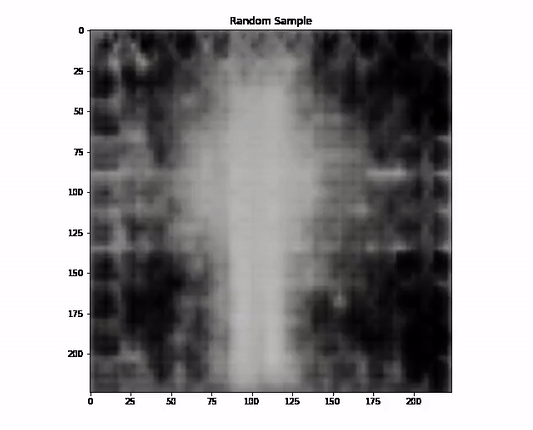
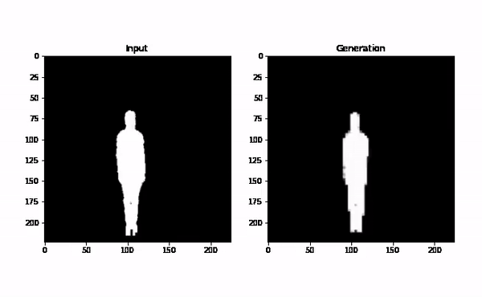

# ActionReplay

The goal is to build a Generative Replay(GR) model that can recognize human actions in a continual learning fashion.

## Setup
```bash
git clone https://github.com/cookiekop/ActionReplay/
mkdir datasets models logs
```
### Prerequisites
- [Python](https://www.python.org/)
- [CUDA](https://developer.nvidia.com/cuda-toolkit)
- [PyTorch](https://pytorch.org/)
- [Matplotlib](https://matplotlib.org/)
- [Jupyter](https://jupyter.org/)

### Datasets
- [**UTD-MHAD**](https://personal.utdallas.edu/~kehtar/UTD-MHAD.html)
Using the depth files to get rid of background.
- [MPII](http://human-pose.mpi-inf.mpg.de/)
Very hard to train VAE for noisy environment.

## Approach
A VAE(pretrained on images)+RNN model.

## Current Result



## Train
```bash
python pretrain_vae.py
python train.py
```

## Evaluate
```bash
jupyter notebook vae_evaluate.ipynb
jupyter notebook actionvae_evaluate.ipynb
```
